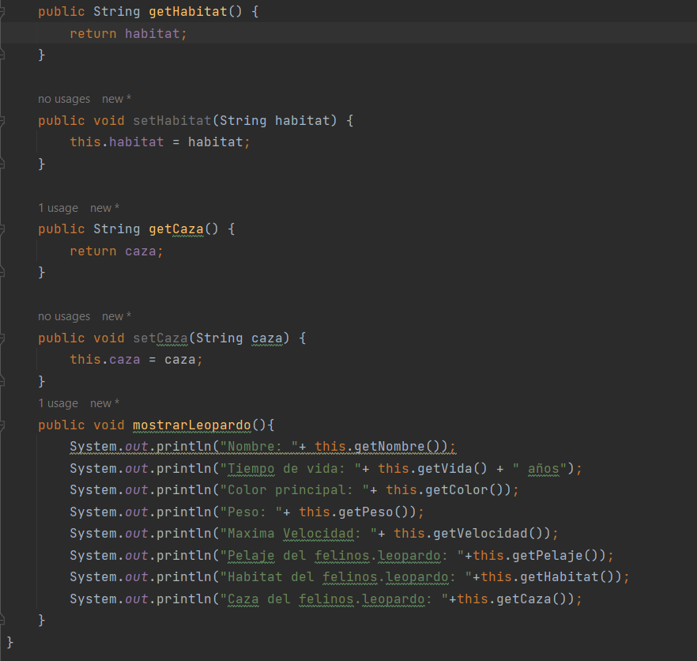
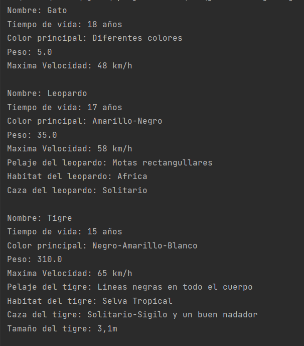

Juan Falconi

## Deber herencia

Instrucciones

Con la temática felinos

Diseñar un diagrama UML para las diferentes especies que pueda consultar.

Implementar una aplicación que permita ingresar felinos de al menos 5 especies.

Entregable: repositorio de github con Readme indicando el contexto del ejercicio y capturas de pantalla del sistema funcionando.

Pueden trabajar en parejas.

## PRESENTACION
En este trabajo veremos 5 especias de felinos los cuales son: Leopardo,tigre,pantera,puma y leon
Con la super clase felinos que llevara caracteristicas en general de los felinos y las subclases que tendran especificaciones de esa propia clase como la caza que tienen, la reproduccion etc.

El fin de este trabajo es entender como funciona la herencia de clases.

    Super clase "Felinos"

    SubClase "Leopardo"

    SubClase "Tigre"

    SubClase "Pantera"

    SubClase "Puma"

    Subclase "Leon"

## Main

    Captura de la consola

